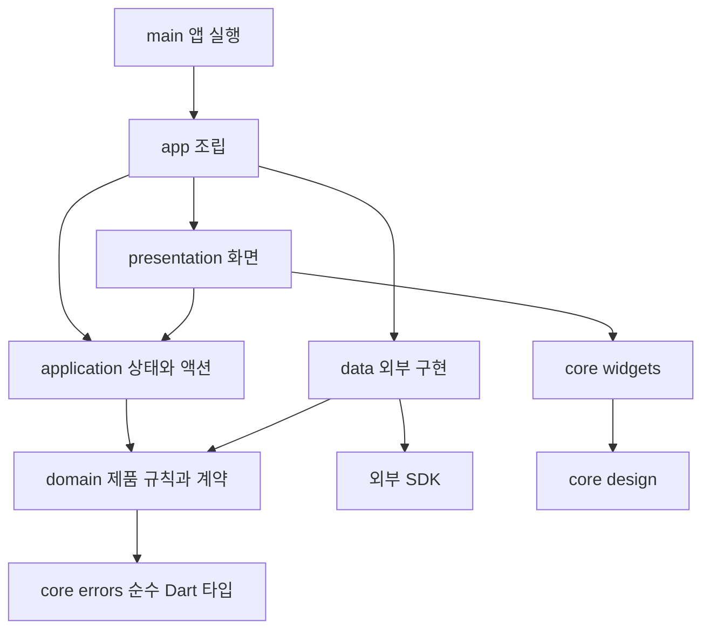

# Nestory 앱 구조

[Issue 5](https://github.com/YunFlutter/nestory/issues/5)의 앱 기반과 후속 기능 구현에 사용할 구조다. 앱 조립, 공통 디자인, 기능별 UI·상태·제품 규칙·외부 데이터 접근의 책임을 나눈다. [개발 지침](../AGENTS.md), [MVP 기획](PRODUCT_PLAN.md), [승인 디자인](DESIGN_SYSTEM.md)과 [Figma 반영 명세](design/FIGMA_DESIGN_SYSTEM.md)를 따른다.

## 현재 단계와 구현 순서

현재 앱은 진입점·시작 처리·루트·임시 화면을 분리하고 Figma 공통 토큰·폰트·테마를 연결했다. 카운터 표시와 증가 동작을 유지하며 한글 안내로 폰트를 확인할 수 있다. 공통 버튼·입력·상태 안내·사진 자리표시는 다음 단계이며, 실제 기능 폴더는 해당 기능의 첫 코드와 함께 만든다.

| 현재 파일 | 책임 |
| --- | --- |
| [lib/main.dart](../lib/main.dart) | `NestoryBootstrap`에 시작 위임 |
| [lib/app/nestory_bootstrap.dart](../lib/app/nestory_bootstrap.dart) | Flutter 초기화·폰트 라이선스 등록·`runApp` |
| [lib/app/nestory_app.dart](../lib/app/nestory_app.dart) | `NestoryApp`, MaterialApp·공통 라이트 테마·시작 화면 조립 |
| [lib/app/demo/counter_page.dart](../lib/app/demo/counter_page.dart) | `CounterPage`와 전용 State, 임시 카운터·한글 안내·글자 확대 |
| `lib/core/design/` | 승인 색·서체·간격·크기·radius, 폰트 자산 경로와 라이선스 등록, 테마 어댑터 |

카운터의 Widget 내 로컬 상태는 임시 템플릿용이다. 제품 기능의 액션·제품 규칙은 아래 application·domain 계층으로 분리한다. 토큰·폰트·테마 구현과 공통 Widget·제품 화면 완성을 구분한다.

| 단계 | 범위 | 확인 기준 |
| --- | --- | --- |
| 앱 구조 | 진입점·앱 조립·임시 카운터 화면 분리, 계층과 파일 배치 정의 | 카운터의 기존 동작 유지, 하위 계층이 진입점을 import하지 않음 |
| 공통 디자인 기반 | 색·서체·간격·크기·형태·폰트·테마 구현 | 승인 원본과 일치, 라이선스·번들·한글·글자 확대 검증 |
| 공통 컴포넌트 | 버튼·입력·상태 안내·사진 자리표시, 후속 단계 | 상태·의미 레이블·실기기 접근성·양쪽 플랫폼 검증 |
| 기능 구현 | 위치·물건·검색·임시 저장·계정 | 기능별 Issue의 제품 동작·저장·권한·예외 검증 |

Firebase·Riverpod·go_router는 기획의 도입 방향이다. 이 구조 정의만으로 설치하거나 구성하지 않는다. 현재 Material 템플릿과 제품의 최종 UI 기반 선택도 구분한다.

## 디렉터리 배치

다음은 현재 `app/`·`core/design/`과 후속 구현의 계획을 합친 배치다. `core/widgets/`·`core/errors/`·`features/`는 필요한 동작을 구현하는 단계에서 추가한다.

```text
lib/
  main.dart                         앱 실행
  app/
    nestory_bootstrap.dart           초기화와 폰트 라이선스 등록
    nestory_app.dart                 루트 Widget과 앱 조립
    demo/
      counter_page.dart             제품 화면 도입 전의 임시 화면
  core/
    design/
      nestory_colors.dart           승인 색 역할
      nestory_fonts.dart            폰트 자산·family·라이선스 등록
      nestory_typography.dart       Noto Sans KR 텍스트 역할
      nestory_spacing.dart          간격과 화면 여백
      nestory_sizes.dart            최소 터치·컨트롤·아이콘·사진 크기
      nestory_radii.dart            모서리 반경
      nestory_theme.dart            선택한 UI 기반에 토큰을 연결하는 어댑터
    widgets/                        공통 표시와 입력 컴포넌트
    errors/                         여러 기능에서 공유하는 오류 타입
  features/
    locations/                      공간과 보관함
    items/                          물건
    search/                         검색
    drafts/                         작성 중 임시 저장
    account/                        계정
```

각 기능은 아래 네 계층을 사용한다. 디렉터리와 클래스는 해당 책임의 첫 구현이 생길 때 추가한다.

```text
features/<feature>/
  presentation/
    screens/                        화면
    widgets/                        해당 기능에서만 쓰는 Widget
  application/
    <feature>_controller.dart       사용자 액션과 상태 전이
    <feature>_state.dart            화면에 전달할 상태
  domain/
    <entity>.dart                   제품 의미와 값
    <feature>_repository.dart       저장·조회 계약이 필요한 경우의 인터페이스
  data/
    <source>_<feature>_repository.dart  도메인 계약의 외부 서비스 구현
    <entity>_dto.dart               외부 저장 형식과 변환이 필요한 경우
```

테스트는 책임별로 `test/app/`, `test/core/`, `test/features/<feature>/`에 배치한다. 기존 `test/widget_test.dart`는 카운터 동작을 유지하는 동안 회귀 검증으로 보존한다.

## 계층별 책임과 의존 방향

아래 화살표는 import와 생성 시 참조하는 방향이다. 실행 결과와 입력은 콜백·상태·도메인 계약을 통해 전달한다.



| 위치 | 담당하는 일 | 의존 경계 |
| --- | --- | --- |
| `main.dart` | 실행과 루트 Widget 연결 | `app`을 시작하며 기능 규칙·저장소 생성은 맡지 않음 |
| `app` | 앱 루트, UI 기반 연결, 실제 구현의 생성·주입, 후속 라우팅 조립 | 구체 데이터 구현을 선택할 수 있는 조립 경계 |
| `presentation` | 화면 표시, 입력 전달, 접근성·포커스·레이아웃 | application 상태와 공통 Widget을 사용; 저장소·SDK를 직접 호출하지 않음 |
| `application` | 사용자 액션, 로딩·빈 상태·성공·오류·재시도 전이 | domain 계약 사용; Widget·화면·구체 데이터 구현에 의존하지 않음 |
| `domain` | 이름·관계·깊이·소유권 등 제품 규칙과 필요한 저장 계약 | 순수 Dart; Flutter·UI 상태·외부 SDK에 의존하지 않음 |
| `data` | 외부 서비스 호출, 저장 형식 변환, SDK 예외 변환 | domain 계약 구현; 화면·컨트롤러에 의존하지 않음 |
| `core/design` | 승인된 공통 시각 값과 UI 기반 어댑터 | 기능과 외부 데이터 접근에 의존하지 않음 |
| `core/widgets` | 재사용 표시·입력과 콜백 | 공통 디자인 사용; 저장 성공 판정·재시도 정책 등 제품 규칙을 넣지 않음 |
| `core/errors` | 공유할 필요가 있는 실패 의미 | UI 메시지·SDK 원문을 포함하지 않는 순수 Dart 타입 |

데이터 구현과 시간·ID 생성 등 외부 조건은 생성자 또는 필요한 계약으로 주입한다. 테스트에서 대체할 수 있게 하되 사용하지 않는 공통 서비스·일괄 추상화는 미리 만들지 않는다. 상태 관리와 라우팅 패키지를 도입할 때도 이 의존 방향을 유지한다.

## 기능의 소유 범위

| 기능 | 소유하는 제품 의미와 동작 |
| --- | --- |
| `locations` | 공간·보관함, 부모 관계·전체 경로, 중첩 깊이·순환 검사, 위치 이동·삭제 가능 여부 |
| `items` | 물건 이름·메모·위치 참조, 물건 등록·수정·이동·삭제, 물건의 텍스트 저장과 사진 상태 |
| `search` | 검색어·검색 결과·정렬·캐시 범위 표현; 위치·물건 조회 계약을 이용한 검색 |
| `drafts` | 계정당 초안 하나, 작성 중 이탈, 기기 보존·서버 동기화·이어쓰기·충돌 |
| `account` | 로그인·로그아웃·비밀번호 재확인·탈퇴 흐름과 사용자 소유권의 계정 문맥 |

기능 간에 화면·컨트롤러·구체 저장소를 import하지 않는다. 공유가 필요한 기능은 상대 기능의 domain 계약을 사용하고 순환 의존이 생기지 않게 한다. 예를 들어 search는 locations와 items의 조회 계약을 사용할 수 있지만 두 기능이 search의 화면이나 상태를 참조하지 않는다. 탈퇴처럼 여러 데이터 정리가 필요한 동작은 계정 기능의 계약과 데이터 구현에서 조정하며 화면이 각 저장소를 순서대로 호출하지 않는다.

이동·삭제의 서버 검증, 사진 재시도, 계정 정리의 부분 실패 등 세부 구현은 해당 기능 Issue에서 정의한다. 클라이언트 계층 분리는 서버·Security Rules의 소유권 검증을 대신하지 않는다.

## 공통 디자인과 컴포넌트

색은 승인된 25개 역할과 `accent`와 같은 값의 `tertiary` 별칭을 사용한다. Figma의 `Nestory / Semantic` 내 `role/` 이름과 코드 역할을 대응시킨다. 타이포그래피는 기존 `Nestory/` 텍스트 스타일 9개의 크기·줄 높이·굵기를 사용하며, Flutter `TextStyle.height`는 `줄 높이 / 글자 크기`다. 폰트 원본·크기·해시·라이선스·가변 굵기 구성은 [폰트 자산](../assets/fonts/README.md)에 기록했다.

`NestoryTheme.light`는 기존 Material 호스트에 토큰을 연결하는 어댑터다. seed 색으로 팔레트를 생성하지 않으며 표면은 흰색 또는 승인된 보조 회색, 주요 행동은 코랄로 연결한다. Material 슬롯은 승인된 텍스트 역할을 재사용한다. 상태별 색 역할은 공통 컴포넌트 구현에서 사용하며 이번 테마 연결만으로 모든 버튼 상태 구현을 완료했다고 보지 않는다.

최소 터치 영역은 확정 문서의 48px을 따른다. Figma의 기존 `size/touch-target` 44px은 이번 코드에 반영하지 않는다. 버튼 52·입력 56px은 최소 높이 토큰이며 큰 글자에서 고정 높이로 사용하면 안 된다.

`core/widgets`의 첫 범위는 주요·보조·위험 버튼, 레이블 입력, 상태 안내, 사진 없는 항목의 자리표시다. 값과 상태는 외부에서 전달하고 입력은 콜백으로 내보낸다. `50자 이름`, `사진 자동 재시도 3회`, `계정당 초안 하나` 같은 규칙은 기능의 domain·application에서 적용한다. 공통 Widget은 서버 저장과 기기 보존 상태를 자체적으로 판정하지 않는다.

공통 타입과 Widget은 각각 별도 파일로 관리한다. 필요에 따라 버튼 종류·상태 등의 enum도 별도 파일에 둔다. 하나의 StatefulWidget과 전용 State는 같은 파일을 사용한다. 공통 오류·도메인 타입을 Widget 파일의 private 타입으로 숨기지 않는다.

## 브랜치와 PR 진행

앱 구조 기반의 첫 작업은 main의 `046b371`에서 만든 `feat/5-app-foundation` 브랜치와 [PR 6](https://github.com/YunFlutter/nestory/pull/6)으로 진행했다. 후속 작업은 최신 main과 해당 Issue를 기준으로 새 작업 브랜치를 만든다. 저장소 규칙인 `<유형>/<Issue번호>-<설명>`을 사용하며 별도 develop 브랜치는 두지 않는다.

1. 의미 있는 첫 커밋으로 Draft PR을 만들고 `Refs #5`로 연결한다.
2. 구조 정의와 이번 변경의 범위를 PR에 기록한다. Issue 5 전체의 디자인·기기 검증이 끝나기 전에는 `Closes #5`를 사용하지 않는다.
3. 코드 변경은 기대 동작의 테스트를 먼저 실행하고 Red·Green·Refactor 근거를 기록한다. 문서만 변경하면 TDD 제외 이유와 내용·링크·diff 검증 결과를 기록한다.
4. 해당 PR 범위의 구현·검증을 마치면 Ready for review로 전환한다. 구현 Issue의 남은 완료 조건은 열린 상태로 유지한다.
5. 병합은 별도 사용자 승인 후 최신 커밋의 검사·미해결 대화·main 충돌을 확인하고 Squash and merge로 진행한다. 작업 브랜치는 병합 후 삭제한다.

이번 구조 정의에서 기능별 인터페이스·데이터 스키마·라우트·패키지 버전을 확정하지 않는다. 관련 기능의 실제 동작과 테스트를 바탕으로 정한다.
